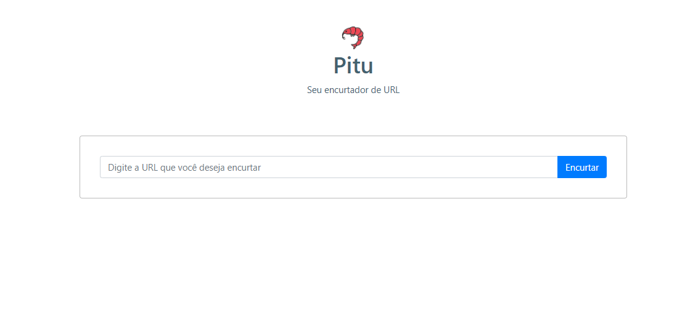

<h1 align="center">
    
    <br>Pitu - Semana Full Stack JS<br/>
    Node.js | ReactJS | Bootstrap | PostgreSQL
</h1>

<p align="center">
    
    
    <br/>
</p>

<p align="center">
    <a href="https://insomnia.rest/run/?label=Pitu%20-%20URL%20Shortener&uri=https%3A%2F%2Fraw.githubusercontent.com%2Fdjpremier%2Fpitu-url-shortener%2Fmain%2Finsomnia.md" target="_blank">
        
    </a>
</p>

<p align="center">
    <a href="#bookmark-sobre-o-projeto">Sobre</a>&nbsp;&nbsp;&nbsp;|&nbsp;&nbsp;&nbsp;
    <a href="#rocket-tecnologias-utilizadas">Tecnologias</a>&nbsp;&nbsp;&nbsp;|&nbsp;&nbsp;&nbsp;
    <a href="#boom-como-executar">Como Executar</a>&nbsp;&nbsp;&nbsp;|&nbsp;&nbsp;&nbsp;
    <a href="#memo-licença">Licença</a>
</p>

<p align="center">
    
<p>

## :rocket: Deploy na AWS
#####:TODO:

## :bookmark: Sobre o Projeto

O **Pitu** é uma aplicação Web que possibilita aos usuários encurtar e vizualizar estatíticas da URL que ele resolveu encurtar.

Este projeto foi idealizado pensando no camarão **pitu**, caracterizado por nascer pequenininho e em sua forma adulta ser muito grande. 

Essa aplicação foi realizada durante a **Semana Full Stack JS**, projeto do professor [Luiz Duarte](https://www.luiztools.com.br).

## :rocket: Tecnologias Utilizadas

-  [Axios](https://github.com/axios/axios)
-  [Date-fns](https://date-fns.org/)
-  [Express](https://expressjs.com/)
-  [PostgreSQL](https://www.postgresql.org/)
-  [Node.js](https://nodejs.org/en/)
-  [NPM](https://www.npmjs.com/)
-  [React Bootstrap](https://react-bootstrap.github.io/)
-  [ReactJS](https://reactjs.org/)
-  [SCSS](https://sass-lang.com/)
-  [Styled Components](https://styled-components.com/)
-  [Typescript](https://www.typescriptlang.org/)
-  [Yarn](https://yarnpkg.com/)

## :boom: Como Executar

- ### **Pré-requisitos**

  - É **necessário** possuir o **[Node.js](https://nodejs.org/en/)** instalado no computador.
  - (opcional) possuir o **[Git](https://git-scm.com/)** instalado e configurado no computador.
  - Também, é **preciso** ter um gerenciador de pacotes seja o **[Yarn](https://yarnpkg.com/)** ou **[NPM](https://www.npmjs.com/)**.
  - Por fim, é **essencial** ter o **[PostgreSQL](https://www.postgresql.org/)** instalado na máquina ou em um container do **[Docker](https://www.docker.com/)**.

1. Obtendo o projeto:

    1. (método rápido) Faça o **[Download](https://github.com/djpremier/pitu-url-shortener/archive/main.zip)** do projeto zipado.

    2. (método com o Git) Faça um clone do repositório:

    ```sh
    $ git clone https://github.com/djpremier/pitu-url-shortener.git
    ```

2. Banco de dados:

    1. (opcional - docker) criar container:
    ```sh
      $ docker run --name pitu_postgres -e POSTGRES_PASSWORD=docker -p 5432:5432 -d postgres
    ```

    2. Criar banco de dados:
      ```sh
      $ psql -U postgres -c 'create database pitu with owner postgres template "template0" encoding "UTF-8"'
      ```

3. Executando a Aplicação:

```sh
  # API
  $ cd backend
  # Instalando as dependências do projeto.
  $ yarn install # ou npm install
  # Inicie a API
  $ yarn dev:server # ou npm dev:server

  # CONEXÃO COM BANCO DE DADOS POSTGRESQL
  # backend > ormconfig.json
  # {
  #   ...
  #   "host": "localhost",
  #   "port": 5432,
  #   "username": "postgres",
  #   "password": "docker",
  #   "database": "pitu",
  #   ...
  # }

  # APLICAÇÃO WEB
  $ cd frontend
  # Instalando as dependências do projeto.
  $ yarn install # ou npm install
  # Inicie a aplicação web
  $ yarn start # ou npm start
```

## :memo: Licença

Esse projeto está sob a licença MIT. Veja o arquivo [LICENSE](LICENSE) para mais detalhes.

---
<sup>Projeto desenvolvido com a tutoria de [Luiz Duarte](https://github.com/luiztools), da [LuizTools](https://www.luiztools.com.br).</sup>